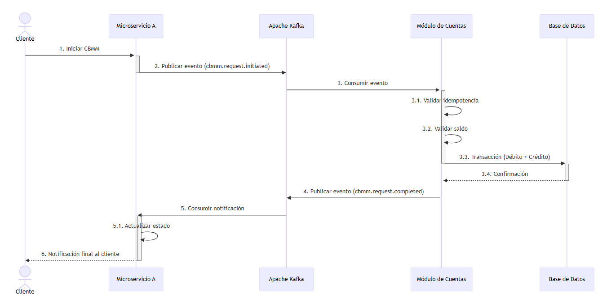
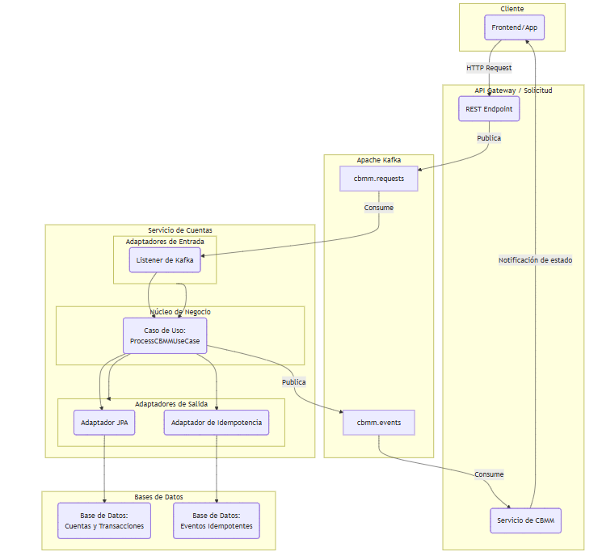

# Cobre - Módulo de Cuentas CBMM

Este repositorio contiene la solución técnica para el desafío de Cobre, implementando un módulo de cuentas robusto y asincrónico para gestionar movimientos de dinero transfronterizos (CBMM). 
La solución está construida con **Spring Boot** y sigue los principios de la **arquitectura hexagonal**.

---

### 1. Arquitectura del Sistema

El diseño del flujo CBMM se basa en una arquitectura de **microservicios orquestada por eventos asincrónicos**. Este enfoque promueve la **idempotencia** y la **consistencia eventual**.

El flujo de eventos es el siguiente:
1.  **Solicitud de CBMM**: El **Microservicio A** publica un evento `cbmm.request.initiated` en un topic de Kafka.
2.  **Procesamiento de Transacción**: El **Módulo de Cuentas** (este servicio) consume el evento. Valida la **idempotencia** del `event_id`, verifica el saldo y realiza las transacciones (débito y crédito).
3.  **Notificación de Resultado**: El Módulo de Cuentas publica un evento final (`cbmm.request.completed` o `cbmm.request.failed`) para informar al Microservicio A del resultado.
4.  **Actualización de Estado**: El Microservicio A actualiza el estado de la solicitud en su propia base de datos.

Este modelo de comunicación asíncrona garantiza la **resiliencia** y la **escalabilidad**.

# **Diagrama de secuencia**:



# **Arquitectura Solución - C4 Nivel(2) de Contenedores**



Este diagrama visualiza la arquitectura de la solución a un nivel de detalle donde los "contenedores" son las aplicaciones, 
los sistemas de datos y los servicios principales. El diagrama muestra el Módulo de Cuentas como se integra en un ecosistema de 
microservicios basado en eventos, destacando el rol de cada componente en el flujo de la transacción.

- **Microservicio A (API Gateway / Solicitud):** Este contenedor actúa como el punto de entrada para las peticiones del cliente. Su responsabilidad es recibir las solicitudes HTTP, validarlas y publicarlas como eventos en el sistema. No se acopla directamente con la lógica de cuentas, lo que lo hace más flexible.
- **Apache Kafka (Mensajería de Eventos):** Este es el corazón asincrónico de la arquitectura. Funciona como un "bus de eventos" que desacopla completamente los servicios. Los eventos son publicados y consumidos de manera asíncrona, lo que permite que los servicios operen de forma independiente. Esto es crucial para la resiliencia y la escalabilidad.
- **Módulo de Cuentas (Servicio de Cuentas):** Este es tu servicio principal. Es un contenedor que procesa eventos de transacciones. Su diseño interno, basado en la arquitectura hexagonal, garantiza que la lógica de negocio esté aislada de la infraestructura. 
  - **Adaptadores:** Los adaptadores de entrada (KafkaListener) traducen los eventos de Kafka, mientras que los adaptadores de salida (AccountRepositoryAdapter, IdempotencyAdapter) se comunican con los sistemas de persistencia.
- **Bases de Datos (Persistencia):** Representan los sistemas de datos de la solución. La base de datos principal almacena las cuentas y las transacciones, mientras que la base de datos de eventos idempotentes se utiliza para garantizar que cada operación se ejecute una sola vez, incluso en caso de reintentos.

---

### 2. Estructura de la Solución (Arquitectura Hexagonal)

El código está organizado en capas para una clara separación de responsabilidades y alta capacidad de prueba.

* **`com.cobre.cbmm.domain`**: El núcleo de la aplicación, independiente de cualquier framework. Contiene las entidades (`Account`, `Transaction`) y los **puertos** (interfaces) que definen las interacciones con el exterior.
* **`com.cobre.cbmm.application`**: Contiene la implementación de los casos de uso (`ProcessCrossBorderMovementService`), orquestando la lógica de negocio.
* **`com.cobre.cbmm.infrastructure.drivenadapters.adapters`**: Contiene los adaptadores que conectan la lógica de negocio con tecnologías externas.
    * `in`: Adaptadores de entrada (`CrossBorderMovementKafkaListener`, `FileProcessorService`).
    * `out`: Adaptadores de salida (`AccountRepositoryAdapter`).

---

### 3. Tecnologías y Requisitos

* **Java 17**: Lenguaje de programación.
* **Spring Boot**: Framework principal.
* **Gradle**: Gestor de dependencias.
* **Librerías**: Lombok, Spring Data JPA, Spring Kafka, Mockito, Testcontainers.

**Requisitos previos:**
* Java 17 (o superior) instalado.
* **Docker Desktop** en ejecución para las pruebas de integración.

---

### 4. Guía de Uso

#### Compilación y Ejecución

1.  Compila el proyecto: 
```bash 
./mvnw clean install
```


2.Ejecuta la aplicación: `java -jar build/libs/cbmm-api-1.0.jar`

```bash 
java -jar build/libs/cbmm-api-1.0.jar
```

#### Pruebas

1.  **Pruebas Unitarias**: Para probar la lógica de negocio aislada.
    `./mvnw test`
2.  **Pruebas de Integración**: Requieren Docker Desktop.
    `./mvnw verify`

---

### 5. Uso de la Inteligencia Artificial

La IA se utilizó como una herramienta de productividad. Se usó para:
- Generar código de:
  - Backoff
  - Retries
  - Circuit breaker
- Diseñar la estrategia de pruebas. 
- Redactar este `README`. 
- Depurar errores. 
- Generar los prompts, y cada una de sus respuestas correspondientes se documentan en el archivo `AI_USAGE.md` del repositorio.

